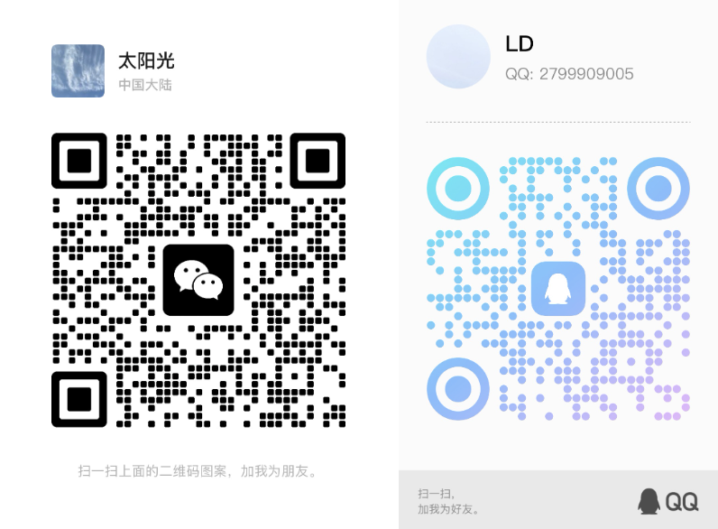
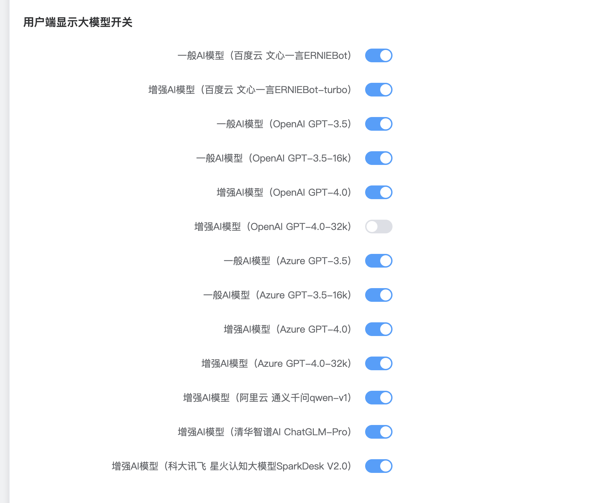
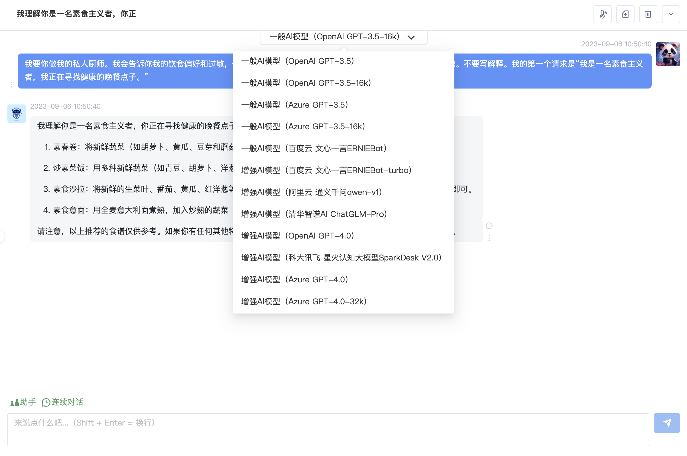
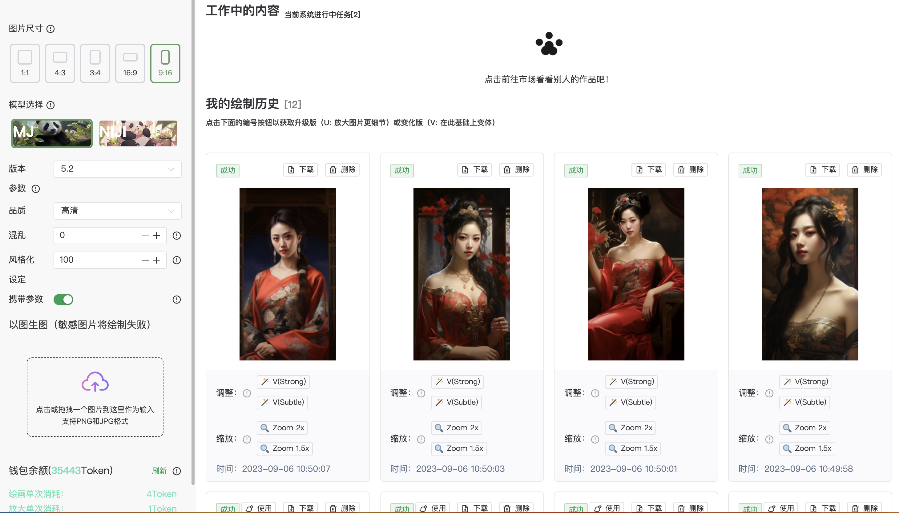

# LeiAI-WEB

### 最新版本： leiai-v4.0.0(20230920发布)

### 项目优势
 - 支持商业运营、从用户、营销、商品、支付、订单、分销提成全流程管理
 - 支持全功能国际版、中国合规版
 - 大模型扩展自由可控
 - 企业服务，保障持续更新
 - 售后1对1服务：保障项目部署功能访问正常
 - 帮助与支持：客服联系方式请滑到底部查看
 - 私有化部署价格详情<a href="http://demoai.leikeduntech.com/pay" style="color:#6c90e3;">点击跳转会员页面</a>

### 主要功能，以下为全功能国际版，另提供国内合规版
 - 支持微软OpenAI/Azure GPT-3.5 GPT-4，百度文心一言，阿里通义千问，清华智谱ChatGLM，科大讯飞星火认知大模型V2版本。
 - 支持大模型自定义控制显示关闭
 - 支持系统预设助手、用户自定义预设助手
 - 支持Midjourney绘画、绘画广场展示
 - 支持AI生成思维导图
 - 支持分销系统
 - 支持每日签到送额度
 - 支持自由设置会员套餐
 - 可商业运营
 - 有完善的用户会员管理系统：支持手机、微信、邮箱注册登陆、用户管理等
 - 对话大模型管理系统：支持国内外众多大模型（百度，阿里，清华智谱，科大讯飞，OpenAI，微软等），支持轮训配置稳定可靠、可自由定制扩展想要的大模型
 - 订单管理
 - 套餐管理：支持直接购买，也支持生成卡密购买
 - 数据管理
 - 助手应用管理：角色扮演、快捷对话、随心定制AI应用
 - 分销管理系统：分销设置、佣金设置管理、提现管理
 - 支付管理系统：支持微信支付、易支付、码支付、虎皮椒支付等
 - 风控管理：支持自定义敏感词、百度敏感词
 - 新增支持Midjourney局部重绘功能(Vary Region 局部重绘)【V4.0.0版本开始支持】
 - 新增支持Midjourney绘画账号池系统，解决高并发问题；【V4.0.0版本开始支持】
 - 以上只是部分功能，更多功能请访问演示系统探索

### Demo演示系统地址：<a href="https://demoai.leikeduntech.com" target="_blank">https://demoai.leikeduntech.com</a>
<ul>
<li>本站是Demo系统，仅作为功能演示作用</li>
<li>用户端演示用户名：user 密码：123456 地址：<a href="http://demoai.leikeduntech.com" style="color:#6c90e3;" target="_blank">demoai.leikeduntech.com</a></li>
<li>管理端演示用户名：admin 密码：123456 地址：<a href="http://demoai.leikeduntech.com/leiai/admin" style="color:#6c90e3;" target="_blank">demoai.leikeduntech.com/leiai/admin</a></li>
</ul>

### 雷AI系统开发计划
 - https://doc.weixin.qq.com/doc/w3_AfEA4Ab5APwkxivai4GRx2UVxlKmT?scode=AAQAlQdCABgooGf0QvAfEA4Ab5APw

### 查看更新记录
 - https://doc.weixin.qq.com/doc/w3_AfEA4Ab5APwK8WF6U9iRCiwzhyKHq?scode=AAQAlQdCABgah3XVZWAfEA4Ab5APw

### ------------微信-------------------------QQ------------

### 部分页面截图

